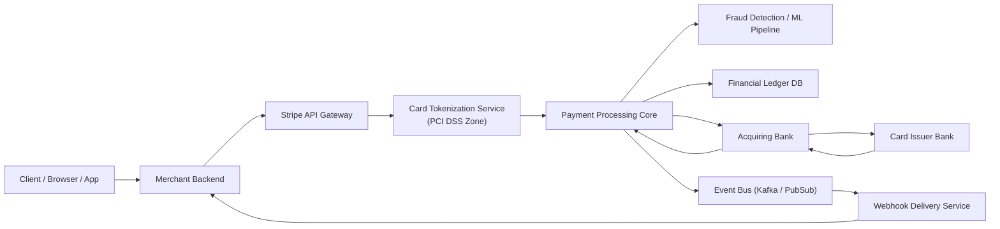
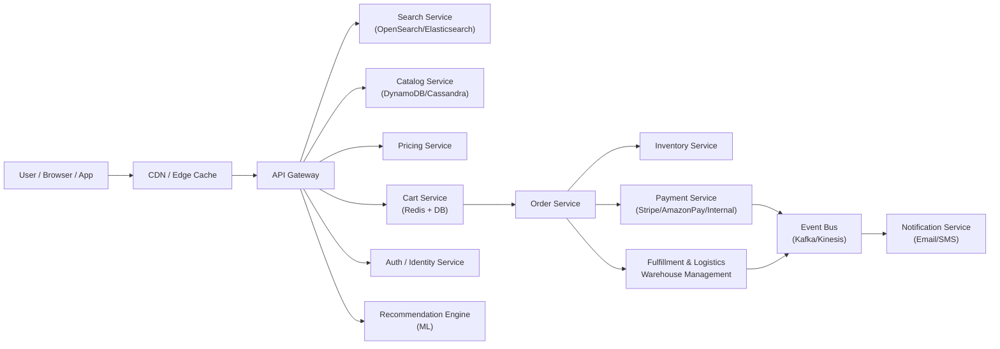

# План интервью по системному дизайну (1.5 часа) + Эталонные ответы

> **Назначение:** Документ предназначен для проведения структурированного собеседования по системному дизайну с кандидатами уровня Middle+ и Senior.

## Содержание

1. [Введение и структура интервью](#1-введение-и-структура-интервью-5-минут)
2. [Общие вопросы по системному дизайну](#2-общие-вопросы-по-системному-дизайну-10-минут)
3. [Практическое задание №1: Stripe](#3-практическое-задание-1-нарисовать-схему-stripe-35-минут)
4. [Практическое задание №2: Amazon e-commerce](#4-практическое-задание-2-нарисовать-схему-amazon-e-commerce-35-минут)
5. [Follow-up вопросы](#5-follow-up-вопросы)
6. [Вопросы повышенной сложности](#6-вопросы-с-повышенной-сложностью)
7. [Критерии оценки](#7-критерии-оценки)
8. [Рекомендации интервьюеру](#8-рекомендации-интервьюеру)

---

## 1. Введение и структура интервью (5 минут)

Краткая настройка кандидата, описание формата: обсуждение принципов системного дизайна + два практических задания (Stripe и Amazon).

---

## 2. Общие вопросы по системному дизайну (10 минут)

### Тематические блоки для проверки:

1. **Определение функциональных и нефункциональных требований**
2. **Масштабирование** (вертикальное / горизонтальное)
3. **Стратегии отказоустойчивости**
4. **CAP-теорема**
5. **Event-driven архитектуры**
6. **ACID vs BASE**
7. **Микросервисы vs модульный монолит**

### Эталонные ответы (развернуто):

#### 1. Функциональные и нефункциональные требования

**Функциональные:**
- Что система должна делать (основные функции)
- Примеры: обработка платежей, поиск товаров, создание заказов

**Нефункциональные (SLAs):**
- **Throughput** (пропускная способность): запросов/сек, транзакций/сек
- **Latency** (задержка): p50, p95, p99
- **Availability** (доступность): 99.9% (3 девятки) = 8.76 часов простоя/год
- **Consistency** (консистентность): strong, eventual, weak
- **Data volume** (объем данных): размер БД, скорость роста
- **Scalability** (масштабируемость): горизонтальное vs вертикальное

**Ожидаемое поведение кандидата:**
- Начинает с уточнения требований перед проектированием
- Задает вопросы о масштабе (количество пользователей, RPS, объем данных)
- Учитывает trade-offs между требованиями

#### 2. Масштабирование

**Вертикальное (Scale Up):**
- Увеличение ресурсов одного сервера (CPU, RAM, диск)
- Проще в реализации, но ограничено физически
- Подходит для: монолитов, систем с низкой нагрузкой

**Горизонтальное (Scale Out):**
- Добавление новых серверов
- Предпочтительно для высоконагруженных систем
- Требует: load balancing, stateless сервисы, распределенные БД
- Подходит для: микросервисов, облачных систем

**Ожидаемое поведение:**
- Понимает разницу и когда что применять
- Учитывает стоимость и сложность реализации

#### 3. Стратегии отказоустойчивости

- **Replication** (репликация): master-slave, master-master
- **Failover** (переключение): автоматическое/ручное, active-passive, active-active
- **Circuit Breaker** (предохранитель): защита от каскадных отказов
- **Retry с exponential backoff**: для временных сбоев
- **Graceful degradation** (деградация): частичная функциональность при сбоях
- **Health checks** и мониторинг

#### 4. CAP-теорема

В распределённой системе при сетевом partition можно гарантировать только 2 из 3:

- **C (Consistency)** — все узлы видят одинаковые данные одновременно
- **A (Availability)** — система отвечает на запросы даже при сбоях
- **P (Partition tolerance)** — система работает при разделении сети

**Примеры:**
- **CP системы**: Spanner, MongoDB (с strong consistency), HBase
- **AP системы**: Cassandra, DynamoDB, CouchDB
- **CA системы**: традиционные SQL БД (PostgreSQL, MySQL) в одной зоне

**Ожидаемое поведение:**
- Понимает, что P нельзя избежать в распределенных системах
- Может объяснить выбор CP vs AP для конкретного случая

#### 5. Event-driven архитектуры

**Преимущества:**
- Асинхронность и decoupling сервисов
- Масштабирование независимых компонентов
- Гибкость в добавлении новых подписчиков

**Компоненты:**
- Event producers (производители событий)
- Event bus (Kafka, RabbitMQ, AWS Kinesis)
- Event consumers (потребители событий)

**Паттерны:**
- Event sourcing
- CQRS (Command Query Responsibility Segregation)
- Saga pattern для распределенных транзакций

**Когда использовать:**
- Независимые домены
- Высокая нагрузка на запись
- Необходимость аудита и replay событий

#### 6. ACID vs BASE

**ACID** (транзакционные системы):
- **Atomicity** — все или ничего
- **Consistency** — данные всегда валидны
- **Isolation** — транзакции не мешают друг другу
- **Durability** — изменения сохраняются

**Примеры:** банковские системы, финансовые транзакции, PostgreSQL, MySQL

**BASE** (высоконагруженные системы):
- **Basically Available** — система доступна большую часть времени
- **Soft state** — состояние может меняться без новых входных данных
- **Eventual consistency** — в конечном итоге данные согласованы

**Примеры:** e-commerce каталоги, социальные сети, аналитика, Cassandra, DynamoDB

**Ожидаемое поведение:**
- Понимает trade-offs между консистентностью и производительностью
- Может выбрать подходящий подход для конкретной задачи

#### 7. Микросервисы vs модульный монолит

**Микросервисы:**
- ✅ Независимый деплой и масштабирование
- ✅ Технологическое разнообразие
- ✅ Четкие bounded contexts
- ❌ Сложность оркестрации
- ❌ Распределенные транзакции
- ❌ Network latency

**Модульный монолит:**
- ✅ Простота разработки и дебага
- ✅ ACID транзакции
- ✅ Низкая latency
- ❌ Сложнее масштабировать отдельные части
- ❌ Технологические ограничения

**Когда что выбирать:**
- **Микросервисы**: большая команда, четкие домены, разные требования к масштабированию
- **Модульный монолит**: небольшая команда, быстрый старт, можно мигрировать позже

---

# 3. Практическое задание №1: «Нарисовать схему Stripe» (35 минут)

## 3.1. Условие

**Задача для кандидата:**
"Представь, что тебе нужно спроектировать платежную систему, похожую на Stripe. Нарисуй высокоуровневую архитектуру и объясни жизненный цикл платежа от момента, когда пользователь вводит данные карты, до финального уведомления мерчанта."

**Контекст для уточнения (если кандидат не спросит сам):**
- Система обрабатывает ~1M транзакций/день
- Требуется PCI DSS compliance
- Latency критична: p99 < 2 секунды
- Availability: 99.99% (4 девятки)
- Поддержка множества платежных методов (карты, банковские переводы, криптовалюты)

**Ожидаемый подход кандидата:**
1. Уточняет требования (масштаб, SLA, ограничения)
2. Определяет основные компоненты
3. Рисует схему с взаимодействиями
4. Объясняет flow платежа
5. Обсуждает trade-offs и альтернативы

---

## 3.2. **Эталонная схема (Mermaid)**

### **Схема процессинга платежей Stripe**

---

## 3.3. **Эталонные ответы (по пунктам)**

### **Основные компоненты Stripe**

1. **API Gateway**
   Обрабатывает запросы, обеспечивает rate limiting, idempotency keys, авторизацию.

2. **Card Tokenization**
   Отделение PCI-информации. Реальные PAN не хранятся в основных сервисах.

3. **Payment Processing Core**
   Реализует state machine для транзакций: initiated → authorized → captured → settled.

4. **Fraud detection**
   ML-пайплайн с feature store, real-time scoring.

5. **Ledger**
   Строго консистентная база (Spanner/Postgres), immutable financial records.

6. **Event Bus**
   Все изменения статусов транзакций отправляются как события.

7. **Webhook delivery system**
   Гарантированная доставка событий мерчанту с retry + exponential backoff.

### Жизненный цикл платежа (Payment Flow)

1. **Инициация платежа:**
   - Клиент отправляет данные карты через мерчанта
   - Мерчант перенаправляет в Stripe API Gateway

2. **Токенизация:**
   - API Gateway отправляет данные в Tokenization Service (PCI DSS зона)
   - PAN (Primary Account Number) заменяется на токен
   - Токен возвращается мерчанту (PAN не покидает PCI зону)

3. **Обработка платежа:**
   - Payment Core получает токен и создает транзакцию
   - State machine: `initiated` → `authorized` → `captured` → `settled`

4. **Проверка на мошенничество:**
   - Fraud Detection анализирует транзакцию (ML scoring)
   - Если риск высокий → транзакция отклоняется или требует дополнительной проверки

5. **Авторизация в банке:**
   - Payment Core отправляет запрос в Acquiring Bank
   - Acquiring Bank связывается с Issuer Bank (банк-эмитент карты)
   - Issuer проверяет баланс и возвращает ответ (approved/declined)

6. **Запись в Ledger:**
   - При успешной авторизации транзакция записывается в Financial Ledger
   - Ledger использует strong consistency (Spanner/Postgres с транзакциями)

7. **События и уведомления:**
   - Payment Core публикует событие в Event Bus (Kafka/PubSub)
   - Webhook Delivery Service доставляет событие мерчанту
   - Гарантированная доставка с retry и exponential backoff

8. **Захват средств (Capture):**
   - Мерчант может захватить средства позже (для pre-authorization)
   - Или сразу (для обычных платежей)

9. **Сettlement (завершение):**
   - После capture средства переводятся на счет мерчанта
   - Обычно происходит в течение 1-2 дней

### Почему именно такая архитектура?

**Безопасность:**
- PCI DSS-compliance требует изоляции обработки карт в отдельной зоне
- Токенизация исключает хранение PAN в основных сервисах
- Даже в зашифрованном виде PAN нельзя хранить вне PCI зоны

**Надежность:**
- Высокая отказоустойчивость через репликацию и failover
- Геораспределённость для снижения latency и повышения availability
- Circuit breaker для защиты от каскадных отказов

**Консистентность:**
- Ledger требует strong consistency для финансовых записей
- Идемпотентность через idempotency keys предотвращает двойные списания
- State machine гарантирует корректные переходы состояний

**Масштабируемость:**
- Event-driven архитектура позволяет независимо масштабировать компоненты
- Асинхронная доставка webhooks не блокирует основной flow
- Горизонтальное масштабирование каждого сервиса

**Производительность:**
- Кеширование на уровне API Gateway
- Асинхронная обработка fraud detection (не блокирует платеж)
- Оптимизация запросов к банкам (connection pooling, timeout management)

---

# 4. Практическое задание №2: «Нарисовать схему Amazon e-commerce» (35 минут)

## 4.1. Условие

**Задача для кандидата:**
"Спроектируй архитектуру e-commerce платформы, похожей на Amazon. Система должна поддерживать каталог товаров, поиск, корзину, оформление заказов, платежи и логистику."

**Контекст для уточнения (если кандидат не спросит сам):**
- 100M+ активных пользователей
- 1B+ товаров в каталоге
- 10M+ заказов/день
- Пиковая нагрузка: 100K RPS на поиск, 50K RPS на каталог
- Latency: поиск < 100ms (p95), каталог < 50ms (p95)
- Availability: 99.9% для критичных сервисов

**Ожидаемый подход кандидата:**
1. Уточняет масштаб и требования
2. Определяет основные сервисы и их взаимодействие
3. Рисует схему с учетом масштабирования
4. Объясняет flow покупки от поиска до доставки
5. Обсуждает стратегии кеширования, шардинга, консистентности

---

## 4.2. **Эталонная схема (Mermaid)**

### **E-commerce архитектура Amazon (упрощённая)**

---

## 4.3. **Эталонные ответы**

### Ключевые сервисы Amazon-подобной архитектуры

* **Catalog** — highly available, AP-система (DynamoDB/Cassandra).
* **Search** — индексирование каталога, шардинг, inverted index.
* **Cart** — in-memory storage + durable DB.
* **Order service** — оркестрация заказа.
* **Payment** — синхронный вызов, но уведомления асинхронные.
* **Inventory** — контроль стоков, event-driven обновление.
* **Logistics** — интеграции с WMS, routing, SLA.
* **Recommendation engine** — ML + real-time personalization.

### Жизненный цикл заказа (Order Flow)

1. **Поиск и просмотр:**
   - Пользователь ищет товары через Search Service
   - Просматривает каталог через Catalog Service
   - Получает рекомендации от Recommendation Engine

2. **Добавление в корзину:**
   - Cart Service сохраняет товары (Redis для быстрого доступа + DB для персистентности)
   - Проверка цены через Pricing Service
   - Проверка наличия через Inventory Service

3. **Оформление заказа:**
   - Пользователь переходит к checkout
   - Order Service создает заказ (state machine: `pending` → `confirmed` → `paid` → `shipped` → `delivered`)
   - Резервирование товаров в Inventory Service

4. **Оплата:**
   - Payment Service обрабатывает платеж (синхронно)
   - При успехе → Order Service обновляет статус на `paid`
   - Событие публикуется в Event Bus

5. **Логистика:**
   - Logistics Service получает событие о подтвержденном заказе
   - Выбирает склад и маршрут доставки
   - Обновляет статус заказа на `shipped`

6. **Уведомления:**
   - Notification Service отправляет email/SMS на каждом этапе
   - Асинхронно через Event Bus

### Нефункциональные требования и решения

**Геораспределённость:**
- Multi-region deployment для снижения latency
- CDN для статического контента и кеширования API ответов
- Репликация БД в нескольких регионах

**Масштабирование:**
- Автоматическое масштабирование на основе метрик (CPU, RPS, queue depth)
- Горизонтальное масштабирование всех сервисов
- Шардинг каталога и поиска по товарным категориям/регионам

**Кеширование:**
- **CDN**: статический контент, изображения товаров
- **API Gateway**: кеширование популярных запросов
- **Application level**: Redis для корзины, популярных товаров, сессий
- **Database level**: read replicas для каталога

**Консистентность:**
- **Catalog**: eventual consistency (AP система) — допустимы кратковременные расхождения
- **Inventory**: strong consistency для критичных операций (резервирование)
- **Order**: strong consistency для финансовых данных
- **Cart**: eventual consistency допустима (можно синхронизировать при checkout)

**Отказоустойчивость:**
- Circuit breaker между сервисами
- Graceful degradation: если Recommendation Engine недоступен, показываем популярные товары
- Retry с exponential backoff для внешних интеграций
- Saga pattern для распределенных транзакций заказа

**Производительность:**
- Асинхронная обработка некритичных операций (уведомления, аналитика)
- Оптимизация запросов к БД (индексы, connection pooling)
- Batch processing для обновления каталога и индексов поиска

---

# 5. Follow-up вопросы

## 5.1. Follow-up по Stripe

1. Как Stripe гарантирует идемпотентность запросов?
2. Что будет, если webhook триггерится десять раз подряд?
3. Почему ledger должен быть strongly consistent?
4. Как реализовать безопасность токенизации?
5. Что делать, если antifraud вернул высокий риск, но банк одобрил транзакцию?
6. Что произойдет при timeout ответа от Issuer?
7. Почему нельзя хранить номера карт в обычной БД даже в зашифрованном виде?

---

## 5.2. Follow-up по Amazon

1. Как шардинг работает в каталоге и поиске?
2. Как обеспечить корректность обработки заказов при частичной недоступности сервисов?
3. Как бороться с race conditions в Inventory?
4. Как дизайнить Cart, чтобы выдержать миллионы RPS?
5. Почему Order service — это state machine?
6. Какие типы индексов используются в поиске?
7. Что произойдёт, если платеж прошёл, а Order service упал до записи заказа?

---

# 6. Вопросы с повышенной сложностью (для стресс-тестирования / «заваливания»)

## Stripe — сложные вопросы

1. Спроектируйте retry-механику взаимодействия с банковскими сетями так, чтобы не было двойных списаний.
2. Объясните, как построить глобальный распределённый ledger с strong consistency и low latency.
3. Как реализовать multi-region active-active архитектуру Stripe?
4. Как построить antifraud, который принимает решения в пределах 50 мс при 50 000 RPS?

## Amazon — сложные вопросы

1. Объясните, как работает inventory reservation на уровне распределённой системы.
2. Как обеспечить atomicity заказа между Cart → Payment → Order → Inventory без распределённых транзакций?
3. Что будет, если Kinesis/Kafka временно недоступны?
4. Как построить поиск, который выдерживает обновления каталога в реальном времени без деградации качества выдачи?
5. Как организовать логистику так, чтобы SLA доставки учитывал real-time доступность складов и маршрутов?

---

# 7. Критерии оценки

## Оценка по уровням

### Junior (1-2 года опыта)
**Ожидается:**
- Понимание базовых концепций (масштабирование, репликация, кеширование)
- Способность нарисовать простую схему с основными компонентами
- Знание основных паттернов (load balancer, database replication)

**Красные флаги:**
- Не может объяснить разницу между вертикальным и горизонтальным масштабированием
- Не учитывает требования при проектировании
- Не понимает trade-offs

### Middle (3-5 лет опыта)
**Ожидается:**
- Понимание CAP-теоремы и выбор CP vs AP
- Способность спроектировать систему с учетом масштаба
- Знание паттернов (circuit breaker, saga, event sourcing)
- Умение оценить throughput и latency

**Красные флаги:**
- Не может объяснить, почему выбрал конкретную БД
- Не учитывает отказоустойчивость
- Не может оценить масштаб системы

### Senior (5+ лет опыта)
**Ожидается:**
- Глубокое понимание trade-offs и компромиссов
- Способность спроектировать multi-region систему
- Знание продвинутых паттернов (CQRS, distributed transactions)
- Умение оценить стоимость и сложность решений
- Опыт работы с реальными высоконагруженными системами

**Красные флаги:**
- Не может объяснить детали реализации
- Не учитывает операционные аспекты (мониторинг, деплой)
- Не может предложить альтернативные решения

### Principal/Staff (7+ лет опыта)
**Ожидается:**
- Способность спроектировать глобальную распределенную систему
- Понимание операционных метрик и SLAs
- Знание индустриальных best practices
- Умение объяснить архитектурные решения с точки зрения бизнеса
- Опыт проектирования систем с миллионами пользователей

## Чек-лист для оценки ответа

### Структура подхода
- [ ] Начинает с уточнения требований
- [ ] Определяет масштаб системы (пользователи, RPS, данные)
- [ ] Разбивает систему на компоненты
- [ ] Объясняет взаимодействие компонентов

### Техническая глубина
- [ ] Правильно выбирает технологии (БД, кеши, очереди)
- [ ] Понимает trade-offs решений
- [ ] Учитывает отказоустойчивость
- [ ] Предлагает стратегии масштабирования

### Коммуникация
- [ ] Четко объясняет решения
- [ ] Использует правильную терминологию
- [ ] Отвечает на follow-up вопросы
- [ ] Признает незнание, когда не уверен

### Практический опыт
- [ ] Приводит примеры из реального опыта
- [ ] Учитывает операционные аспекты
- [ ] Думает о стоимости решений
- [ ] Предлагает итеративный подход к разработке

---

# 8. Рекомендации интервьюеру

## Подготовка к интервью

1. **Изучите документ заранее** — знайте эталонные ответы и схемы
2. **Подготовьте инструменты** — доска для рисования (Miro, Excalidraw) или бумага
3. **Проверьте технические детали** — убедитесь, что понимаете все концепции

## Во время интервью

### Начало (5 минут)
- Представьтесь и объясните формат
- Уточните уровень кандидата (если не знаете)
- Создайте комфортную атмосферу

### Общие вопросы (10 минут)
- Задавайте открытые вопросы
- Если кандидат не знает ответ — переходите к следующему
- Оценивайте глубину понимания, а не заучивание

### Практические задания (35 минут каждое)

**Структура:**
1. **Уточнение требований (5-10 минут)**
   - Поощряйте вопросы кандидата
   - Если не задает — задайте сами для контекста

2. **Проектирование (15-20 минут)**
   - Дайте время на размышление
   - Помогайте направлять, но не давайте готовые решения
   - Оценивайте процесс мышления

3. **Обсуждение (10-15 минут)**
   - Задавайте follow-up вопросы
   - Проверяйте понимание trade-offs
   - Углубляйтесь в интересные моменты

### Типичные ошибки кандидатов

**Что искать:**
- ❌ Начинает рисовать без уточнения требований
- ❌ Не учитывает масштаб системы
- ❌ Выбирает технологии без обоснования
- ❌ Игнорирует отказоустойчивость
- ❌ Не может объяснить trade-offs
- ❌ Переоценивает или недооценивает сложность

**Как помочь:**
- Направляйте вопросами: "А что если нагрузка увеличится в 10 раз?"
- Уточняйте: "Почему ты выбрал именно эту БД?"
- Проверяйте понимание: "Что произойдет, если этот сервис упадет?"

## После интервью

1. **Зафиксируйте оценки** по критериям из раздела 7
2. **Отметьте сильные и слабые стороны**
3. **Подготовьте feedback** для кандидата (если требуется)

## Дополнительные ресурсы

- **Книги:** "Designing Data-Intensive Applications" (Martin Kleppmann)
- **Практика:** systemdesigninterview.com, leetcode.com/system-design
- **Примеры:** архитектуры реальных систем (YouTube, блоги компаний)

---

# 9. Заключение

Данный документ содержит:
- ✅ Структурированный план интервью на 1.5 часа
- ✅ Эталонные схемы (Mermaid) для визуализации
- ✅ Развернутые эталонные ответы с объяснениями
- ✅ Follow-up вопросы для углубленной проверки
- ✅ Вопросы повышенной сложности для senior-уровня
- ✅ Критерии оценки по уровням
- ✅ Рекомендации для интервьюера

**Использование:**
- Используйте как чек-лист при проведении интервью
- Адаптируйте под специфику вашей компании
- Дополняйте реальными примерами из вашего опыта

**Возможные расширения:**
- Добавить low-level design задачи
- Расширить схемы до детального уровня
- Добавить примеры численных оценок (capacity planning)
- Подготовить PDF-версию для печати
